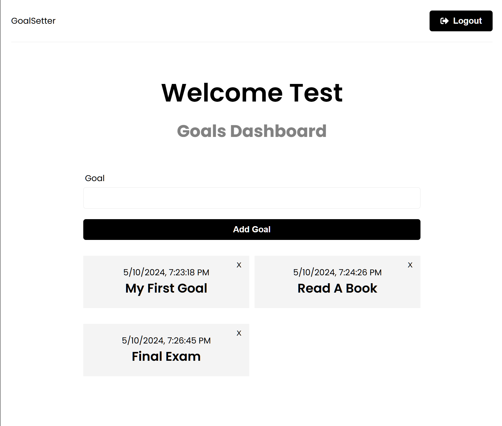

# Goal Tracker
The Goals Tracker App is a web application that allows users to set, track, and manage their goals. Users can create, update, and delete goals, as well as view a list of their current goals.

# Features
- User authentication: Users can sign up, log in, and log out securely.
- Create goals: Users can create new goals with a title and optional description.
- View goals: Users can view a list of their current goals along with their creation dates.
- Delete goals: Users can delete goals they no longer wish to track.

# Technologies Used
- React: Frontend framework for building user interfaces.
- Redux Toolkit: State management library for managing application state.
- React Router: Library for handling routing within the React application.
- Axios: HTTP client for making API requests.
- Node.js: JavaScript runtime for running server-side code.
- Express.js: Web application framework for building RESTful APIs.
- MongoDB: NoSQL database for storing user data.
- JWT: JSON Web Tokens for secure user authentication.